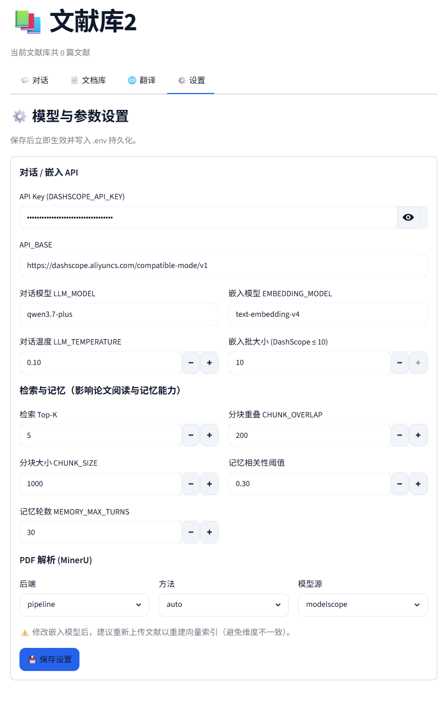

# RefMind 文献知识库助手

RefMind 是一个面向科研文献阅读的 RAG 问答系统，基于 LangChain 1.0 与 LangGraph 搭建，
将离线入库与在线问答分开：
- 离线：PDF 解析清洗 → 按语义切分 Chunk → 标注来源/章节/页码/版本/权限等 metadata
  → 建立向量索引与 BM25 关键词索引。
- 在线：Query → 规划少量检索角度 → 并行混合召回 → 全局 reranker 精排 → 上下文压缩
  （去重、句级过滤、字数预算）→ LLM 生成并基于证据审校可溯源答案。

目标是在读论文时能快速问答，同时尽量避免大模型脱离原文乱答。

## 功能

- 混合召回：BM25 关键词 + Chroma 向量，等权融合，中文用 jieba 分词
- 重排精排：召回候选交给 rerank 模型（DashScope gte-rerank，缺失时回退嵌入相似度）
- 上下文压缩：去除重复分块、剔除离题句子、按字数预算截断，压缩进 Prompt 的内容
- 分块 metadata：来源、文档 id、页码、章节、版本、权限（按库隔离）、分块序号、字数
- PDF 解析与论文切分：优先 MinerU 保留标题、段落、公式、图表、页码、阅读顺序和 bbox；按章节边界合并语义块，未安装或失败时回退 PyMuPDF
- PDF 分阶段并行：解析、图片摘要、Embedding 批次和文档中文摘要使用独立全局上限；
  摘要与向量化重叠执行，设置页可调整并发并查看逐阶段耗时
- 论文身份与引用：从 PDF 首页恢复原始论文题名并分配稳定库内序号；正文采用论文式
  `[1][2]`，悬浮显示题名/页码/章节/证据段落，回答末尾按论文聚合参考来源
- PDF 引用定位：点击正文引用可在受控窗口中预览目标页，并依据 bbox 或证据原文尽力高亮；
  本地运行还可请求系统 PDF 阅读器跳到对应页，不公开上传文件路径
- GS 外部学术检索：输入区可按会话选中 `GS检索`；将问题改写为学术检索式，并行查询
  Semantic Scholar 与 Crossref（配置 Key 后可选 OpenAlex），按 DOI 去重、Reranker 精选后，
  仅把题录与摘要作为本轮临时证据；外链引用与本地 PDF 页码引用严格分离
- 文档库治理：按论文原始题名展示，可多选后批量清理文档记录、向量/BM25、原 PDF、
  解析结果与图片资产，单篇失败不影响其余删除
- 图片检索与问答：入库时将原图保存到本地 docstore，并用 `qwen3.5-omni-plus-2026-03-15` 生成结构化摘要写入文本索引；命中图片摘要后才读取原图、Base64 编码并交给全模态模型回答
- 多文献库隔离：每个库独立的 Chroma 集合与持久化目录，互不干扰
- 三层记忆：SQLite 会话历史、SQLite 用户长期语义/情景记忆、Chroma + BM25 论文知识严格隔离
- 翻译与摘要：流式输出，翻译可结合当前文献库做术语对齐，入库时自动生成摘要
- 熔断降级：主对话模型连续失败后临时切到备选模型，冷却后再探测切回
- 受控 multi-agent：规划、并行检索、直接可回答性审查与答案审校职责分离，失败自动回退基线
- 稳定重复问答：统一中英文尾部标点，原问题始终参与召回与重排，记忆仅扩展检索角度，
  重复问题不会携带上一次回答作为生成历史
- 插件扩展：解析、入库、检索和生成阶段提供类型化 hook，第三方异常不会打断主流程
- 可选 MCP：支持 stdio / Streamable HTTP 的能力探测、工具调用与资源读取，默认不把外部内容送入答案
- 可恢复入库：原子文件写入 + 异常补偿 + 启动恢复，未提交向量不会长期混入检索

## 技术栈

- Python 3.11+
- LangChain 1.0 + LangGraph（RAG 流程与状态编排）
- Chroma（向量检索）、rank-bm25 + jieba（关键词检索与中文分词）
- Streamlit（前端）
- DashScope（OpenAI 兼容接口的对话/嵌入模型）
- Semantic Scholar / OpenAlex / Crossref（用户显式开启时的开放学术检索）
- MCP Python SDK（可选，用于连接显式配置的外部工具与资源）
- SQLite（组、文档、会话、消息等元数据）

## 目录结构

```
app.py                     Streamlit 前端
refmind/
    config/                配置（.env 驱动，前端设置页可改）
    storage/               SQLite 持久化
    parsing/               PDF 解析（MinerU + PyMuPDF 回退）
    llm/                   模型工厂 + 熔断降级、翻译、摘要
    agents/                规划、并行检索、证据审查与答案审校
    plugins/               hook 协议、插件注册与发现
    integrations/          可选 MCP 客户端与外部上下文信任边界
    rag/                   分块入库、混合召回、重排、上下文压缩、记忆、LangGraph 流程
    services/              上传入库、开放学术索引检索等业务编排
evaluation/                RAG 评测（检索/生成指标）
scripts/                   冒烟测试、模型探测等脚本
tests/                     不依赖真实 API 的单元与集成回归测试
```

## 快速开始

```bash
git clone https://github.com/LiuYj9/RefMind.git
cd RefMind

python -m venv .venv
.venv\Scripts\activate            # Windows

.venv\Scripts\python.exe -m pip install -r requirements.txt

# 只有需要连接 MCP 服务时才安装
.venv\Scripts\python.exe -m pip install -r requirements-mcp.txt

copy .env.example .env            # 填入 DASHSCOPE_API_KEY

.venv\Scripts\python.exe -m streamlit run app.py  # 默认 http://localhost:8888
```

> Windows 上请勿直接运行裸 `streamlit`：它可能来自另一套 Python。始终用项目
> `.venv\Scripts\python.exe -m streamlit`，确保 DashScope、LangChain 与前端版本一致。

若出现 `No module named 'dashscope'` 或“调用报错”，先执行：

```powershell
.\.venv\Scripts\python.exe -m pip install -r requirements.txt
.\.venv\Scripts\python.exe -m pip check
.\.venv\Scripts\python.exe -m streamlit run app.py
```

需要高精度解析时再额外安装 MinerU：`pip install mineru`。

详细架构见 [docs/architecture.md](./docs/architecture.md)，插件与 MCP 配置见
[docs/plugins-and-mcp.md](./docs/plugins-and-mcp.md)。

## 主要设计

- 分块 metadata：每个 Chunk 带来源、文档 id、页码、章节、版本、权限（按库隔离）、
  分块序号与字数，既支持答案溯源，也为后续按条件过滤/治理留出空间。
- 混合召回：向量负责语义泛化，BM25 负责专业术语精确匹配，两者等权融合出候选池。
- 重排精排：候选交给 reranker 按 (query, chunk) 相关性重新打分排序，优先 DashScope
  rerank 模型，未安装或失败时回退到嵌入余弦相似度，只保留最相关的前若干条。
- 上下文压缩：精排后再去掉近似重复分块、按句子粒度剔除离题内容、按字数预算截断，
  在保留关键证据的同时降低冗余与 token 消耗；嵌入不可用时退化为仅按字数截断。
- 记忆治理：会话历史按相关性过滤；跨会话用户记忆经原子提取、价值阈值、重复合并、
  同主题冲突失效和按类型时间衰减后再召回。论文事实从不写入用户记忆表。
- 无检索即拒答：LangGraph 的论文 `retrieve→generate` 核心段中，检索为空时直接返回“未找到相关内容”，减少幻觉。
- 解析容错：MinerU 失败自动回退 PyMuPDF，保证基本可用。
- 可恢复写入/删除：源 PDF 使用 `doc_id` 唯一路径，解析 JSON 原子替换；异常时按
  `doc_id` 补偿，进程强杀留下的非 `ready` 记录会在下次启动继续清理。
- 并行入库安全：每篇 PDF 使用独立事务与临时文件；单篇失败不取消其他任务，同一文献库的
  Chroma 变更细粒度串行提交，SQLite 使用 WAL 与 busy timeout 缓解短写锁竞争。
- 受控 multi-agent：规划最多三个子查询，并发召回后统一重排/压缩；证据门禁始终对照用户原问题，
  仅有关键词重合或相邻主题时拒答。规划、单路检索、审校任一失败都保留上一阶段有效结果或
  回退单查询，不让增强能力成为单点故障。
- GS 检索边界：只有用户主动选中按钮才会把改写后的查询发送给外部学术索引；外部论文摘要
  不写入 Chroma/SQLite 文献表，不与本地全文分块混排，也不伪造页码。外部无可用摘要时会
  明确告警后回退本地库。项目不抓取 Google Scholar HTML，避免验证码、封禁与页面结构风险。
- 插件隔离：hook 按注册顺序变换数据，插件注册和运行异常会被记录并隔离；核心阶段还会校验
  返回类型，避免错误插件污染主链路。
- MCP 信任边界：只连接 `.env` 显式声明的服务；外部结果默认只供探测/人工检查，必须由代码
  明确设置 `allow_in_answers=True` 才能进入答案上下文。
- 熔断降级：连续失败达到阈值后走备选模型，冷却后只允许一个 half-open 探测；流式输出中途
  失败不会与备选模型输出拼接。
- 动态配置：设置页改完参数写回 `.env`，并清掉模型/检索器缓存即时生效。

> multi-agent 只扩展检索角度，合并后仍复用同一套“重排 → 压缩 → 生成”生产链路；关闭后直接
> 回到原 LangGraph 基线，便于做同口径评测。

## 常用配置

| 变量 | 说明 | 默认值 |
|------|------|--------|
| `DASHSCOPE_API_KEY` | DashScope API Key | 必填 |
| `REFMIND_USER_ID` | 本地长期记忆的用户隔离 ID | `local_user` |
| `LLM_MODEL` | 对话模型 | `qwen3.7-plus` |
| `MULTIMODAL_LLM_MODEL` | 图片摘要及携图回答模型 | `qwen3.5-omni-plus-2026-03-15` |
| `LLM_FALLBACK_MODEL` | 备选模型（留空则不降级） | 空 |
| `LLM_CIRCUIT_FAILURE_THRESHOLD` | 连续失败多少次熔断 | `3` |
| `LLM_HEALTH_CHECK_INTERVAL` | 熔断冷却秒数 | `60` |
| `EMBEDDING_MODEL` | 嵌入模型 | `text-embedding-v4` |
| `CHUNK_SIZE` / `CHUNK_OVERLAP` | 普通段落目标大小 / 超长块内部重叠 | `1000` / `200` |
| `LAYOUT_CHUNK_MAX_CHARS` | 表格、公式等原子版面块的二次切分上限 | `1800` |
| `PDF_MAX_PARALLEL_DOCUMENTS` | 同批上传最大并行解析文档数（1~8） | `2` |
| `DOCSTORE_DIR` | 原图本地存储目录（不进入向量库） | `./data/docstore` |
| `IMAGE_SUMMARY_ENABLED` | 入库时是否调用全模态模型生成图片摘要 | `true` |
| `IMAGE_SUMMARY_MAX_WORKERS` | 全局图片摘要并发请求数（1~8） | `4` |
| `EMBEDDING_MAX_PARALLEL_BATCHES` | 全局 Embedding 并发批数（1~8） | `4` |
| `DOCUMENT_SUMMARY_MAX_WORKERS` | 全局文档中文摘要并发请求数（1~8） | `4` |
| `IMAGE_MAX_PER_ANSWER` | 单次回答最多携带的已命中图片数 | `3` |
| `IMAGE_MAX_BYTES` | 单张允许 Base64 发送的最大原图字节数 | `4194304` |
| `RETRIEVAL_TOP_K` | 检索返回片段数 | `5` |
| `RECALL_TOP_K` | 重排前的召回候选数 | `20` |
| `RERANK_ENABLED` | 是否启用重排 | `true` |
| `RERANK_MODEL` | 重排模型（DashScope） | `gte-rerank-v2` |
| `RERANK_TOP_N` | 重排后保留片段数 | `5` |
| `CONTEXT_COMPRESSION_ENABLED` | 是否启用上下文压缩 | `true` |
| `CONTEXT_MAX_CHARS` | 送入 Prompt 的上下文字数上限 | `4000` |
| `MEMORY_MAX_TURNS` | 记忆保留轮数 | `30` |
| `MEMORY_RELEVANCE_THRESHOLD` | 记忆相关性阈值 | `0.3` |
| `ACADEMIC_SEARCH_ENABLED` | 是否显示并允许使用 GS检索 | `true` |
| `ACADEMIC_SEARCH_PROVIDER` | `auto` / `semantic_scholar` / `openalex` / `crossref` | `auto` |
| `ACADEMIC_SEARCH_TOP_K` | 重排后送入 LLM 的外部论文摘要数 | `5` |
| `ACADEMIC_SEARCH_CANDIDATE_K` | 每个学术索引的候选召回数 | `15` |
| `SEMANTIC_SCHOLAR_API_KEY` | Semantic Scholar Key（可选，可提高限流稳定性） | 空 |
| `OPENALEX_API_KEY` | OpenAlex 免费 API Key（选择/融合 OpenAlex 时需要） | 空 |
| `CROSSREF_MAILTO` | Crossref polite pool 联系邮箱（建议） | 空 |
| `LONG_TERM_MEMORY_ENABLED` | 启用跨会话语义/情景记忆 | `true` |
| `LONG_TERM_MEMORY_TOP_K` | 单轮最多召回长期记忆数 | `6` |
| `LONG_TERM_MEMORY_MIN_IMPORTANCE` | 候选写入最低重要度 | `0.45` |
| `LONG_TERM_MEMORY_MIN_CONFIDENCE` | 候选写入最低置信度 | `0.70` |
| `LONG_TERM_MEMORY_DUPLICATE_THRESHOLD` | 重复记忆合并阈值 | `0.92` |
| `SEMANTIC_MEMORY_HALF_LIFE_DAYS` | 语义记忆权重半衰期（天） | `180` |
| `EPISODIC_MEMORY_HALF_LIFE_DAYS` | 情景记忆权重半衰期（天） | `45` |
| `MULTI_AGENT_ENABLED` | 启用受控 multi-agent | `true` |
| `MULTI_AGENT_MAX_SUBQUERIES` | 最大检索子查询数（1~3） | `3` |
| `MULTI_AGENT_MAX_WORKERS` | 并行检索线程数 | `3` |
| `MULTI_AGENT_RETRIEVAL_TIMEOUT` | 并行检索等待上限（秒） | `30` |
| `MULTI_AGENT_EVIDENCE_REVIEW` | 检查证据能否直接回答原问题 | `true` |
| `MULTI_AGENT_ANSWER_REVIEW` | 检查问题对齐并基于证据审校草稿 | `true` |
| `REFMIND_PLUGIN_MODULES` | 逗号分隔的插件模块 | 空 |
| `REFMIND_MCP_SERVERS` | MCP 服务 JSON 数组 | 空 |

其余配置见 `.env.example`。

## 说明

- 对话与嵌入都依赖有效的 `DASHSCOPE_API_KEY`。
- BM25 是内存索引，文档增删后会自动重建。
- 数据默认放在 `./data/`（已在 `.gitignore` 忽略）。
- 图片不会写入 Chroma：Chroma 仅保存结构化摘要、页码和 docstore 路径；生成阶段会再次校验路径位于 `DOCSTORE_DIR`，并且只加载被当前检索命中的图片。
- 单 GPU 本地运行 MinerU 时，解析并发建议先设为 `2` 或 `3`；更高数值可能因模型重复加载与显存争用反而变慢。

## 测试与探测

```bash
# 全部离线回归测试（不调用真实模型或 MCP 服务）
python -m unittest discover -s tests -v

# 探测 .env 中声明的 MCP 服务能力
python scripts/probe_mcp.py

# 调用已确认安全的 MCP 工具
python scripts/probe_mcp.py --server papers --tool search --arguments '{"query":"RAG"}'
```

端到端模型与向量库烟测仍使用 `python scripts/smoke_test.py`；它需要有效 API Key 和
`data/sample_paper.pdf`，不属于离线测试。

## 界面预览

| 对话问答 | 设置页 |
|----------|--------|
|  |  |
